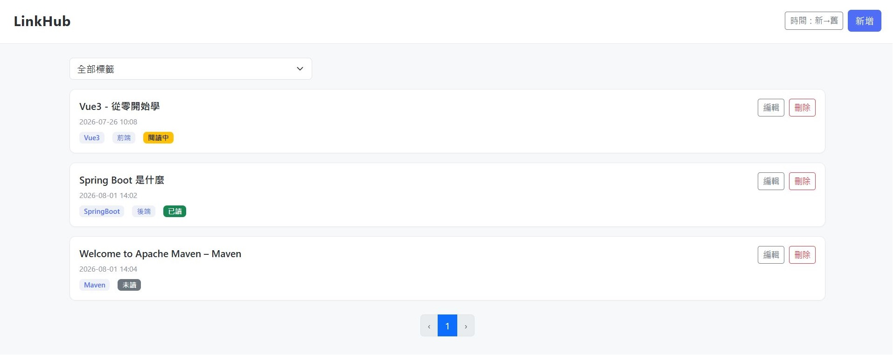

# LinkHub
<p align="center">
  
</p>

[關於](#關於)

[功能特色](#功能特色)

[快速啟動（Docker）](#quick-start-docker)

[開始使用（本機開發模式）](#get-started-native-development)

[技術堆疊](#技術堆疊)

[專案結構](#專案結構)

[資料庫設計](#資料庫設計)

[API 規格](#api-space)

[AI 輔助開發聲明](#api-assisted-development)

---

## 關於

LinkHub 是一個 URL 連結管理 Web 應用程式，提供連結的增刪改查、標籤過濾、時間排序、分頁查詢，以及貼上 URL 後自動取得網頁標題等功能。

※該專案目前為透過瀏覽器使用的單機應用。
## 功能特色

- **連結 CRUD**：新增、編輯、刪除、查詢連結記錄
- **自動取得元數據**：使用者貼上 URL 後，自動發送 `/url/metadata` 請求獲取網頁標題
- **標籤過濾**：透過下拉選單選擇標籤，快速篩選連結
- **時間排序**：支援依建立時間升降序排列
- **分頁查詢**：每頁顯示 10 筆連結記錄，避免一次查詢過多資料

## <a id="quick-start-docker"></a>快速啟動（Docker）

本專案提供 Docker 與 Docker Compose 設定，可一句指令啟動完整環境（包含 MySQL 資料庫與應用程式），無需手動建立資料表結構。

### 環境需求

- Docker 20.10+
- Docker Compose 1.29+

### 啟動步驟

1. 確保 Docker 與 Docker Compose 已安裝並啟動
2. 在專案根目錄執行：

```bash
docker-compose up --build
```

3. 等待啟動完成後，開啟瀏覽器前往：
```
http://localhost:8080/pages/linkRecord.html
```

### 說明

- `docker-compose up --build` 會自動完成以下事項：
  - 建置 Spring Boot 應用程式 Docker 映像檔
  - 啟動 MySQL 8.0 容器
  - 自動執行 `docs/database.sql` 建立資料表結構
  - 啟動應用程式容器並連接 MySQL
- MySQL 資料庫資料會持久化儲存在 Docker volume `mysql_data` 中
- 資料庫連線設定已內建在 `docker-compose.yml`，无需額外修改

### 設定自己的密碼

1. 複製 `.env.example` 為 `.env`（或直接編輯 `.env`）
2. 修改 `.env` 中的密碼：
   ```env
   MYSQL_ROOT_PASSWORD=你的MySQL root密碼
   DATABASE_USERNAME=你的應用程式資料庫使用者名稱
   DATABASE_PASSWORD=你的應用程式資料庫密碼
   ```
3. `.env` 已列入 `.gitignore`，不會被提交到版本控制

### 停止與清除

```bash
# 停止服務（保留資料庫資料）
docker-compose down

# 停止服務並刪除資料庫資料（重新初始化）
docker-compose down -v
```

### 常用指令

| 指令 | 說明 |
|------|------|
| `docker-compose up --build` | 建置映像檔並啟動所有服務（首次啟動或更新程式碼後使用） |
| `docker-compose start` | 啟動已停止的服務（不重建映像檔） |
| `docker-compose stop` | 停止執行中的服務（保留容器和資料） |
| `docker-compose restart` | 重新啟動服務 |
| `docker-compose down` | 停止並移除容器、網路（保留 volume 資料庫資料） |
| `docker-compose down -v` | 停止並移除容器、網路、volume（一併刪除資料庫資料） |

## <a id="get-started-native-development"></a>開始使用（本機開發模式）

### 1. 環境需求

- JDK 17+
- Maven 3.8+
- MySQL 8.0+

### 2. 資料庫設定

1. 建立資料庫並匯入 `docs/database.sql`
2. 修改 `src/main/resources/application.yml` 中的資料庫連線資訊

### 3. 啟動應用程式

```bash
./mvnw.cmd spring-boot:run
```

### 4. 訪問應用程式

開啟瀏覽器前往：
```
http://localhost:8080/pages/linkRecord.html
```

## 技術堆疊

### 後端
- Java 17
- Spring Boot 3.5.3
- MyBatis 3.5.17
- MySQL
- Maven

### 前端
- HTML5
- CSS3
- Bootstrap 5.3.3
- Vue 3（CDN）
- Fetch API

## 專案結構

```
src/main/java/com/lyh/linkhub/
├── LinkhubApplication.java          # Spring Boot 啟動類別
├── controller/
│   ├── LinkRecordController.java    # 連結記錄 REST API
│   └── UrlMetadataController.java   # URL 元數據 API
├── service/
│   ├── LinkRecordService.java       # 連結記錄業務邏輯
│   └── UrlMetadataService.java      # URL 元數據取得服務
├── pojo/
│   ├── LinkRecord.java
│   ├── LinkRecordPage.java
│   ├── CreateLinkRecordRequest.java
│   ├── UpdateLinkRecordRequest.java
│   ├── UrlMetadataRequest.java
│   └── UrlMetadataResponse.java
└── mapper/
    ├── LinkRecordMapper.java
    ├── LinkRecordMapper.xml
    ├── TagMapper.java
    └── TagMapper.xml

src/main/resources/
├── application.yml                  # 應用程式設定
├── mapper/                          # MyBatis XML 映射檔案
└── static/
    ├── pages/
    │   └── linkRecord.html          # 前端主頁面（含內嵌 Vue3 JavaScript）
    └── styles/
        └── style.css                # 前端樣式

docs/
├── database.sql                     # 資料庫結構與種子資料
└── openapi.yaml                     # API 規格文件
```

## 資料庫設計

請參考 `docs/database.sql` 建立資料庫與資料表。主要表格包括：

- `link_status`：連結閱讀狀態（未讀、閱讀中、已讀）
- `link_record`：連結記錄主表
- `tag`：標籤表
- `link_record_tag`：連結與標籤關聯表

## <a id="api-space"></a>API 規格

詳細 API 規格請參考 `docs/openapi.yaml`。

### 主要端點

| 方法 | 路徑 | 說明 |
|------|------|------|
| GET | `/linkRecord` | 查詢連結記錄（支援分頁、排序、標籤過濾） |
| POST | `/linkRecord` | 新增連結記錄 |
| PUT | `/linkRecord/{id}` | 更新連結記錄 |
| DELETE | `/linkRecord/{id}` | 刪除連結記錄 |
| GET | `/linkRecord/tags` | 取得所有標籤列表 |
| POST | `/url/metadata` | 從 URL 獲取元數據（網頁標題） |

## <a id="api-assisted-development"></a>AI 輔助開發聲明

本專案由 **AI 輔助開發** 完成。

### 使用工具

- **Kilo**（互動式 CLI AI 程式設計助手）

### 使用模型

- **kilo-auto/free**

### 貢獻歸屬

#### 使用者（專案擁有者）的貢獻

- 專案目錄結構建立與程式碼目錄規劃（`controller`、`service`、`pojo`、`mapper` 等）
- 資料庫表結構設計（`docs/database.sql`）
- Web API 規格設計（`docs/openapi.yaml`）
- 技術堆疊選型與確認（Java 17、Spring Boot 3.5.3、MyBatis、MySQL、Vue3 CDN 等）
- 專案初始化設定（`pom.xml`、`application.yml` 資料庫連線、`LinkhubApplication.java`）
- 前端頁面雛型定義
- 功能需求定義與規格確認
- 關鍵實作決策（例如：metadata 使用 `HttpURLConnection`、tag 僅操作關聯表不自動建立等）
- Docker 容器化部署、volume 配置

#### AI（Kilo / kilo-auto/free）的貢獻

- 根據 `database.sql` 與 `openapi.yaml`，撰寫完整的後端程式碼：
  - POJO 類別（`LinkRecord`、`LinkRecordPage`、Request / Response）
  - MyBatis Mapper 介面與 XML 映射檔案
  - Service 層業務邏輯（CRUD、分頁、排序、Tag 關聯處理）
  - Controller 層 REST API 實作
  - `/url/metadata` 端點實作（使用 `HttpURLConnection` 抓取 `<title>`）
- 前端頁面：
  - 根據雛型定義撰寫前端頁面，內嵌 Vue3（CDN）+ Fetch API
  - 實作 Tag 下拉篩選、閱讀狀態顯示、分頁、排序等功能
- Dockerfile 與 docker-compose.yml 撰寫
- `application.yml` 環境變數化更新
- 程式碼除錯與修正（編譯錯誤、API 規格對齊、生命週期掛鉤位置錯誤等）
- README.md 撰寫與章節重新編排

### 是否提供 UML 模型對 AI 輔助開發的差異

LinkHub 和 [LinkHub_2](https://github.com/LYH-94/link_hub_2) 的功能相同，差別在於是否將事先設計好的 UML 模型（系統架構圖、循序圖及類別圖）提供給 AI 作為開發依據。

當提供設計好的 UML 模型時，AI 能夠依照既定的規格進行開發，產出的程式碼在整體架構、資料流、模組職責及命名風格上都具有較高的一致性。由於 UML 是依照自己的設計理念規劃，因此後續閱讀、除錯與維護程式時，也能更容易理解各個元件的用途及彼此之間的關係。

相較之下，若沒有提供 UML 模型，AI 會依照自身的理解進行設計。雖然同樣能完成需求，但程式架構、命名方式及資料流未必符合原本的設計想法，因此需要花費更多時間閱讀與理解 AI 的設計思路，後續調整與維護的成本也相對較高。

由於本專案規模較小、業務邏輯也相對單純，因此即使沒有提供 UML 模型，AI 產生的程式碼仍然容易理解。然而，隨著系統規模與複雜度提升，是否事先完成系統設計所帶來的差異，預期也會越來越明顯。換句話說，提供越完整的設計文件，AI 越能產生符合設計者預期的程式碼。
